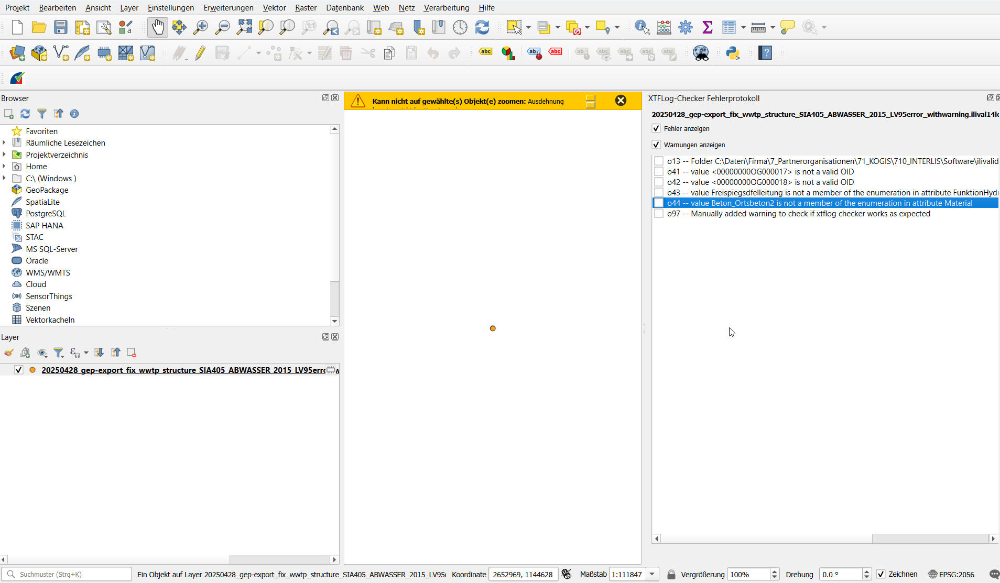
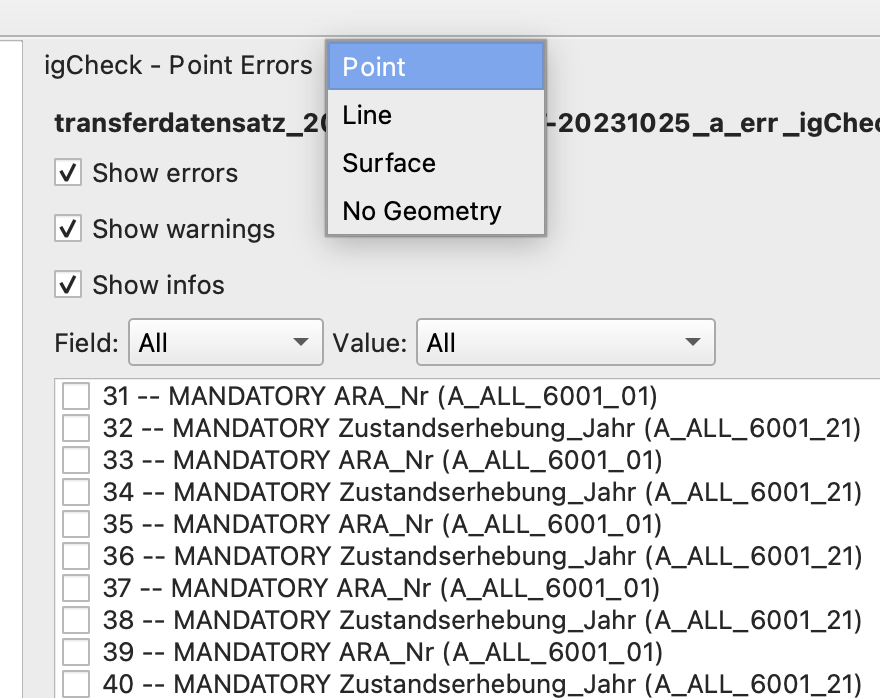
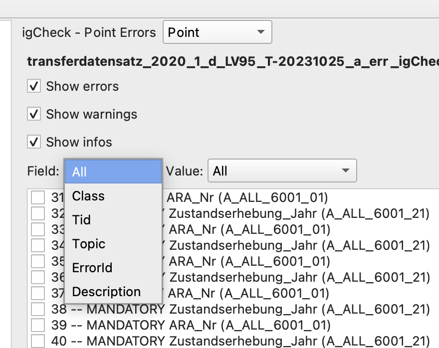

# XTFLog-Checker

## What do I use XTFLog-Checker for?
XTFLog-Checker is a [QGIS](https://www.qgis.org/en/site/) plugin that lets you display errors in XTFLog files created by the [Ilivalidator](https://www.interlis.ch/downloads/ilivalidator) and [iG/Check](https://www.interlis.ch/en/downloads/igcheck). When opening an XTFLog file in QGIS with this plugin, a checklist is created that helps you keep track of your progress when addressing the errors.

## Where can I get it?
Install the [QGIS XTFLog-Checker](https://plugins.qgis.org/plugins) directly in QGIS by using the [Plugins menu](http://docs.qgis.org/latest/en/docs/user_manual/plugins/plugins.html).

## Qt6 supported
Beginning with version 1.30, Qt6 support has been added. The plugin is now compatible with both Qt5 and Qt6 builds of QGIS.
As QGIS based on Qt6 is still in its early testing phase, some bugs may occur.
Please report any problems you experience by submitting an issue.

## Requirements
- QGIS version: 3.40 or later
- Tested on Windows, macOS, and Linux

## How to use

1. Click on the XTFLog-Checker Icon 

The following dialog will appear:

2. A. Select the error log xtf file you want to be visualized.

   B. You can also load an XTF URL by copying the address and pasting it into the input box.

C. You can also load a URL from an online validation service, such as [ilicop.ch](https://ilicop.ch/).

3. Click on 'Create Layer' - the error log will be analyzed and the results will be displayed.

4. Use the **Layer Switch** dropdown or reopen the dialog to change layers.

### Ilivalidator

All Errors are displayed on the same layer. The latest version also supports the display of Errors without an assigned geometry. 

### iG/Check

Since Release 1.1.0 also iG/Check Errors logs are supported. For each Geometry type an extra layer is created and connected with the respective errors. There are four possible layers:

   * NoGeometry
   * Points
   * Lines
   * Surfaces

The following INTERLIS Error log versions are supported: 
https://www.infogrips.ch/models/2.3/ErrorLog14.ili (since release 1.1.0)
and https://www.infogrips.ch/models/2.4/ErrorLog24.ili (since release 1.2.0)

### Change layer

Click on the XTFLog-Checker Icon  again

In the following dialog choose the layer you want to be displayed:

Or you can change the layer from the “Layer Switch” dropdown in the panel.

### Filter errors by category

You can filter the errors by their categories: [errors, warnings, info]:

You can also use the advanced selection, to choose Class,Tid,Topic,ErrorId,Description,After selecting, the first item will be automatically highlighted and zoomed in.

### Tooltip with additional information

You can get additional information about the error with the tooltip:

Further details you get by opening the attribute table of the respective layer

## License
The XTFLog-Checker plugin is licensed under the [GPL-3.0 license](LICENSE).  
Copyright © 2025
[GeoWerkstatt GmbH](https://www.geowerkstatt.ch) & [Stefan Jürg Burckhardt, Software, Informationsmanagement, Beratung (SJiB)](https://www.sjib.ch/)
