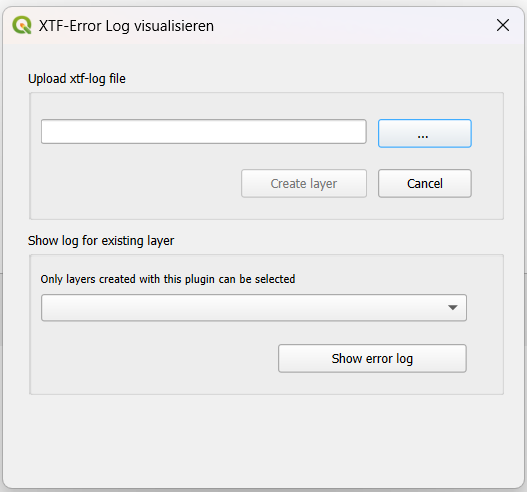

# XTFLog-Checker

## What do I use XTFLog-Checker for?
XTFLog-Checker is a [QGIS](https://www.qgis.org/en/site/) plugin that lets you display errors in XTFLog files created by the [Ilivalidator](https://www.interlis.ch/downloads/ilivalidator) and [iG/Check](https://www.interlis.ch/en/downloads/igcheck). When opening an XTFLog file in QGis with this plugin, a checklist is created that helps you keep track of your progress when addressing the errors.

## Where can I get it?
Install the [QGIS XTFLog-Checker](https://plugins.qgis.org/plugins) directly in QGIS by using the [Plugins menu](http://docs.qgis.org/latest/en/docs/user_manual/plugins/plugins.html).

## How to use
Click on the XTFLog-Checker Icon 

The following dialog will appear:

Select the error log xtf file you want to be visualized.

Click on 'Create Layer' - the error log will be analyzed and the results will be displayed.

### Ilivalidator

All Errors are displayed on the same layer. The latest version also supports the display of Errors without an assigned geometry. 

### iG/Check

Since Release 1.1.0 also iG/Check Errors logs are supported. For each Geometry type an extra layer is created and connected with the respective errors. There are four possible layers:

   * NoGeometry
   * Points
   * Lines
   * Surfaces

### Change layer

Click on the XTFLog-Checker Icon  again

In the following dialog choose the layer you want to be displayed:

### Filter errors by category

You can filter the errors by their categories: [errors, warnings, info]

### Tooltip with additional information

You can get additional information about the error with the tooltip:

Further details you get by opening the attribute table of the respective layer

## License
The XTFLog-Checker plugin is licensed under the [GPL-3.0 license](LICENSE).  
Copyright © 2025 [GeoWerkstatt GmbH](https://www.geowerkstatt.ch) & [Stefan Jürg Burckhardt, Software, Informationsmanagement, Beratung (SJiB)](https://www.sjib.ch/)
